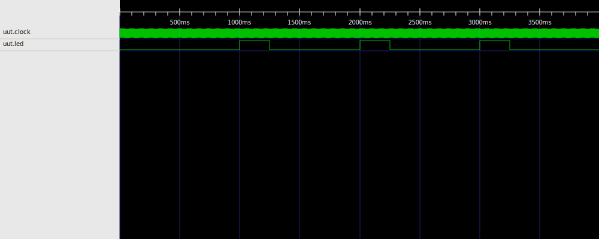

# Quickstart for Simulation

If you don't have an FPGA (or the one I used in the blinky quickstart), then you can just do everything
using simulation.

To add `rust-hdl` to your project, simply create a new project and then add `rust-hdl` as a dependency:
```shell
samitbasu@fedora jnk]$ cargo new testme
     Created binary (application) `testme` package
[samitbasu@fedora jnk]$ cd testme
[samitbasu@fedora testme]$ cargo add rust-hdl
    Updating crates.io index
      Adding rust-hdl v0.38.2 to dependencies.
[samitbasu@fedora testme]$ 
```

To get the most benefit from `rust-hdl` you should probably 
install [yosys](https://github.com/YosysHQ/yosys).
`Yosys` provides more sophisticated checking on the generated Verilog and it also provides some
synthesis pathways for some of the more open-source friendly FPGAs.

Then replace `main.rs` with the following.

```rust
use std::time::Duration;
use rust_hdl::prelude::*;

const CLOCK_SPEED_HZ : u64 = 10_000;

#[derive(LogicBlock)]  // <- This turns the struct into something you can simulate/synthesize
struct Blinky {
    pub clock: Signal<In, Clock>, // <- input signal, type is clock
    pulser: Pulser,               // <- sub-circuit, a widget that generates pulses
    pub led: Signal<Out, Bit>,    // <- output signal, type is single bit
}

impl Default for Blinky {
   fn default() -> Self {
       Self {
         clock: Default::default(),
         pulser: Pulser::new(CLOCK_SPEED_HZ, 1.0, Duration::from_millis(250)),
         led: Default::default(),
       }
    }
}

impl Logic for Blinky {
    #[hdl_gen] // <- this turns the update function into an HDL Kernel that can be turned into Verilog
    fn update(&mut self) {
       // v-- write to the .next member     v-- read from .val() method
       self.pulser.clock.next = self.clock.val();
       self.pulser.enable.next = true.into();
       self.led.next = self.pulser.pulse.val();
    }
}

fn main() {
    // v--- build a simple simulation (1 testbench, single clock)
    let mut sim = simple_sim!(Blinky, clock, CLOCK_SPEED_HZ, ep, {
        let mut x = ep.init()?;
        wait_clock_cycles!(ep, clock, x, 4*CLOCK_SPEED_HZ);
        ep.done(x)
    });

    // v--- construct the circuit
    let uut = Blinky::default();
    // v--- run the simulation, with the output traced to a .vcd file
    sim.run_to_file(Box::new(uut), 5 * sim_time::ONE_SEC, "blinky.vcd").unwrap();
    vcd_to_svg("blinky.vcd","blinky_all.svg",&["uut.clock", "uut.led"], 0, 4 * sim_time::ONE_SEC).unwrap();
    vcd_to_svg("blinky.vcd","blinky_pulse.svg",&["uut.clock", "uut.led"], 900 * sim_time::ONE_MILLISECOND, 1500 * sim_time::ONE_MILLISECOND).unwrap();
}
```

Finally, run this simulation
```shell
[samitbasu@fedora testme]$ cargo run --release
   Compiling testme v0.1.0 (/home/samitbasu/Devel/jnk/testme)
    Finished release [optimized] target(s) in 0.92s
     Running `target/release/testme`
[samitbasu@fedora testme]$ 
```

You should now have a `vcd` file that can be viewed with a tool like [gtkwave](http://gtkwave.sourceforge.net/).  Alternately, RustHDL 
includes the ability to generate an `svg` file from the `vcd` file.
This is the end result showing the entire simulation:

Here is a zoom in showing the pulse to the LED


